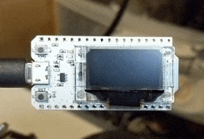

# SMART-BMS-Bluetooth-Cell-Voltage-Monitor-HILTEC
Small cell voltage monitor for XIAOXIANG SMART BMS Bleutooth BLE, only requires 5vdc connection
Smart-BMS-Bluetooth-ESP32
Program to read out and display data from xiaoxiang Smart BMS over Bluetooth Low Energy
https://www.lithiumbatterypcb.com/
Tested with original BLE module provided. Might work with generic BLE module when UUIDs are modified

Needs ESP32 and graphic display.
Tested on HILTEC ESP32 WROOM 32: https://heltec.org/project/wifi-kit-32/

Fork from the work of: (c) Miroslav Kolinsky 2019 https://www.kolins.cz

thanks to Petr Jenik for big parts of code
thanks to Milan Petrzilka

heavily inspired by https://github.com/bres55/Smart-BMS-arduino-Reader

 

Notes:

1. Install Hardware libraries on Arduinio IDE per this turotial: https://robotzero.one/heltec-wifi-kit-32/
2. I used this case from Thingiverse. PLA, 15% infill. Extended the longer dimesion by 2% in the print. https://www.thingiverse.com/thing:3148876
3.The only connection required is 5vDC from ESC, BLE connection is automatic.
